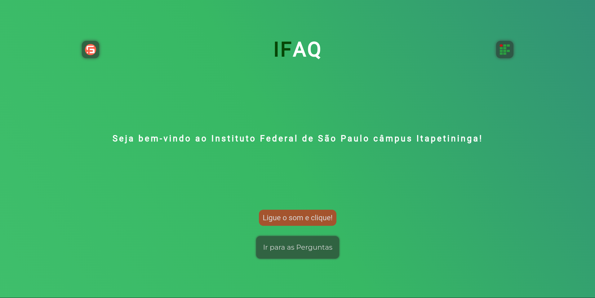

# IFAQ

# Descrição do Projeto

O IFAQ é um aplicação desenvolvido no intuito de disponibilizar respostas para questões frequentes a respeito do IFSP Câmpus Itapetininga. Nele existe uma serie de perguntas, pré-definidas, que ao serem selecionadas são lidas e em seguida respondidas através de audio. Utilizando-se das bibliotecas SwiperJS e AnimateCsss e as tecnologias HTML, CSS, JavaScritp e NodeJS.

# Status do Projeto
Status: Finalizado

# Funcionalidades e Demonstração da Aplicação
Afim de que as perguntas fossem faladas se utilizou a API "Web Speech API", atraves da interface "SpeechSynthesisUtterance", nativa da ferramenta. Nela é possivel informar um texto, a velocidade de leitura e o tom da voz, para haver a repodução da fala.

# Instruções de Uso
Para acessar o IFAQ localmente, deve ser feito o clonamento deste repositório.

1. `git clone`

Após isso, executar no terminal, os comandos:

2. `npm install`
3. `npm start`

E basta acessar a hospedagem local.

# Acesso ao Projeto (Link do Projeto)
[IFAQ](https://ifaq.fabsoftware.itp.ifsp.edu.br/perguntas.html)

# Contribuição/Autores
| [ Leonardo Domingos da Luz](https://github.com/leonardoDluz)| [ André Augusto](https://github.com/andreaugusto-sourc) |[ João Pedro Martins](https://github.com/Martins-pedro23) |
| :---: | :---: | :---: |
